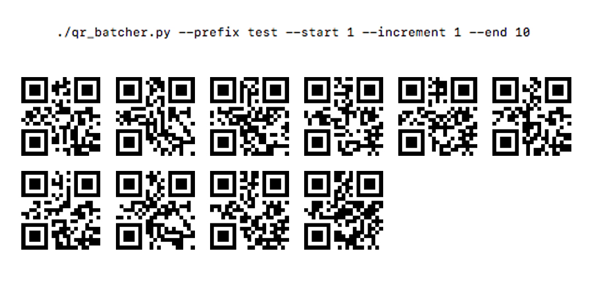

# QR Batcher

QR Batcher allows you to mass-generate QR codes with a specified prefix.
Useful in a variety of applications where the identification of indivual objects
in a group is required. 

# Demo

# Requirements
Pillow, fpdf and qrcode modules for Python 3

# Usage

> usage: ./qr_batcher.py

> --prefix &lt;prefix&gt;

> --start &lt;start#&gt;

> --increment &lt;increment by #&gt;

> --end &lt;terminate at #&gt;
